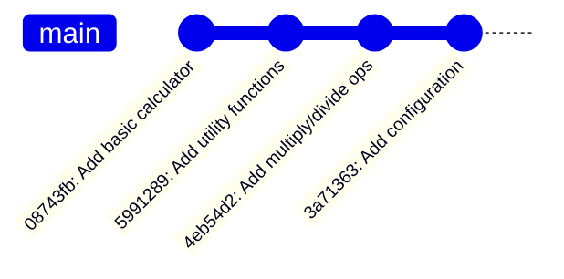
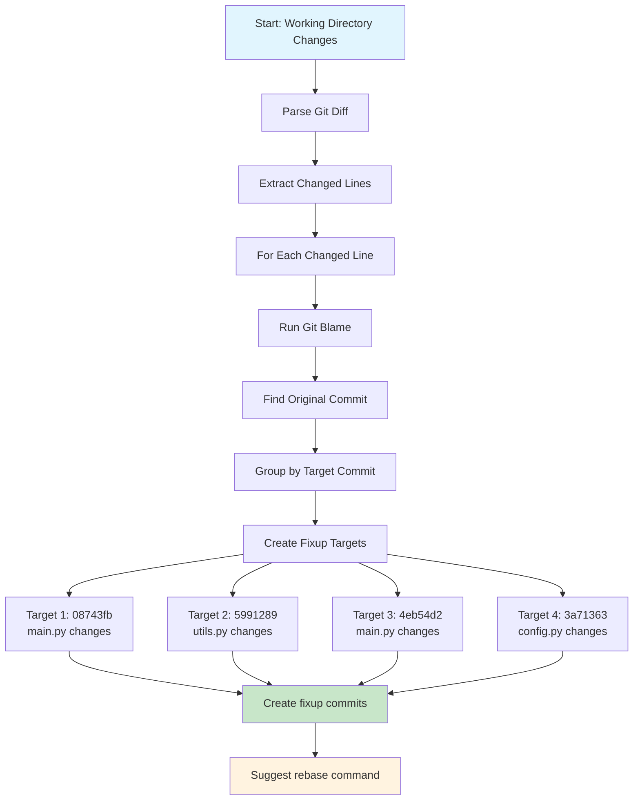
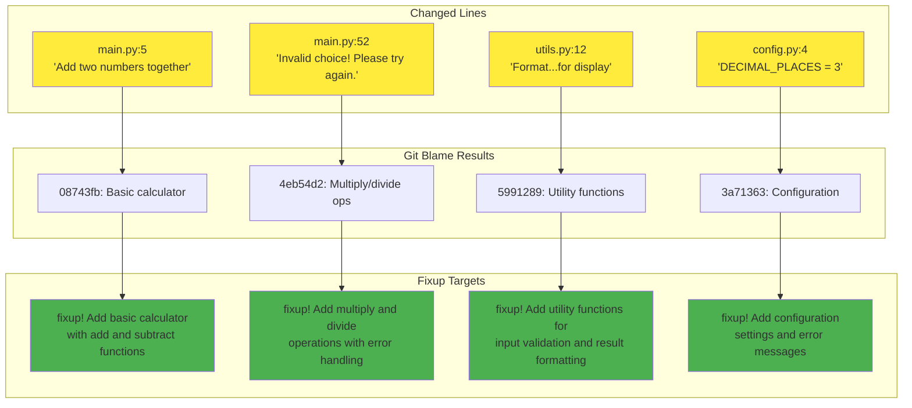

# Test Case Documentation

This document explains the test case environment and demonstrates how Fast Fixup Finder processes changes to identify fixup targets.

## Test Case Overview

The `testcase/` directory contains a complete git repository with a realistic commit history that demonstrates the tool's functionality.

### Repository Structure

```
testcase/
├── main.py      # Calculator application (main logic)
├── utils.py     # Utility functions  
├── config.py    # Configuration settings
└── demo.sh      # Demonstration script
```

## Commit History

The test repository has the following commit history:



### Detailed Commit Timeline

| Commit | Message | Files | Key Content |
|--------|---------|--------|-------------|
| `08743fb` | Add basic calculator with add and subtract functions | `main.py` | Basic add/subtract operations, main function |
| `5991289` | Add utility functions for input validation and result formatting | `utils.py` | `is_valid_number()`, `format_result()` |
| `4eb54d2` | Add multiply and divide operations with error handling | `main.py` | Multiply/divide functions, enhanced main loop |
| `3a71363` | Add configuration settings and error messages | `config.py` | Display settings, error messages |

## Current Working Directory Changes

To demonstrate the fixup finder, the following changes were made to the files:

### Changes Made

| File | Line | Original | Modified | Target Commit |
|------|------|----------|----------|---------------|
| `main.py` | 5 | `"""Add two numbers."""` | `"""Add two numbers together."""` | `08743fb` (basic calculator) |
| `main.py` | 52 | `print("Invalid choice!")` | `print("Invalid choice! Please try again.")` | `08743fb` → `4eb54d2` |
| `utils.py` | 12 | `"""Format the calculation result."""` | `"""Format the calculation result for display."""` | `5991289` (utility functions) |
| `config.py` | 4 | `DECIMAL_PLACES = 2` | `DECIMAL_PLACES = 3` | `3a71363` (configuration) |

## Processing Flow

Here's how Fast Fixup Finder processes these changes:



## Detailed Processing Example

### Step 1: Git Diff Analysis

```bash
$ git diff
diff --git a/main.py b/main.py
index abc123..def456 100644
--- a/main.py
+++ b/main.py
@@ -4,7 +4,7 @@
 
 def add(a, b):
-    """Add two numbers."""
+    """Add two numbers together."""
     return a + b
...
```

### Step 2: Git Blame Trace

For the changed line at `main.py:5`:

```bash
$ git blame main.py -L 5,5
08743fb3 (Author 2024-01-01 10:00:00 +0000 5)     """Add two numbers."""
```

### Step 3: Target Identification



## Tool Output Example

### Status Command

```bash
$ fastfixupfinder status
Found 4 potential fixup targets:

• 3a71363c: Add configuration settings and error messages
  Author: Klaus Gerlicher
  Files: config.py
  Changed lines: 2

• 08743fb3: Add basic calculator with add and subtract functions
  Author: Klaus Gerlicher
  Files: main.py
  Changed lines: 3

• 4eb54d25: Add multiply and divide operations with error handling
  Author: Klaus Gerlicher
  Files: main.py
  Changed lines: 1

• 59912895: Add utility functions for input validation and result formatting
  Author: Klaus Gerlicher
  Files: utils.py
  Changed lines: 2
```

### Analysis Command

```bash
$ fastfixupfinder analyze
Detailed analysis of 4 fixup targets:

1. Target Commit: 3a71363cb34fe17b0c2645b0f7501409e8a12e9f
   Message: Add configuration settings and error messages
   Author: Klaus Gerlicher
   Affected files: 1
     config.py (2 changes)
       - Line 4: DECIMAL_PLACES = 2...
       + Line 4: DECIMAL_PLACES = 3...

2. Target Commit: 08743fb3f981939d82d2aead1214c500db2de44b
   Message: Add basic calculator with add and subtract functions
   Author: Klaus Gerlicher
   Affected files: 1
     main.py (3 changes)
       - Line 5:     """Add two numbers."""...
       + Line 5:     """Add two numbers together."""...
       - Line 52:         print("Invalid choice!")...
...
```

## Running the Test Case

### Prerequisites

```bash
cd testcase
# Ensure you're in the test repository
git status  # Should show modified files
```

### Basic Demo

```bash
# Run the complete demonstration
./demo.sh

# Or run commands individually
PYTHONPATH=.. python3 -m fastfixupfinder.cli status
PYTHONPATH=.. python3 -m fastfixupfinder.cli analyze  
PYTHONPATH=.. python3 -m fastfixupfinder.cli create --dry-run
```

### Interactive Testing

```bash
# Create fixup commits interactively
PYTHONPATH=.. python3 -m fastfixupfinder.cli create --interactive

# Select which targets to create fixups for
# Example: Enter "1,3" to create fixups for targets 1 and 3

# Apply the fixups
git rebase -i --autosquash HEAD~7
```

## Expected Results

When you run the tool on this test case, you should see:

1. **4 fixup targets** identified
2. **Correct commit mapping** for each changed line
3. **Grouped changes** by their original commits
4. **Proper fixup commit creation** with `fixup!` prefix
5. **Rebase command suggestion** for applying changes

## Learning Outcomes

This test case demonstrates:

- ✅ **Multi-file change detection**
- ✅ **Cross-commit change grouping** 
- ✅ **Git blame integration**
- ✅ **Interactive selection workflow**
- ✅ **Dry-run functionality**
- ✅ **Proper fixup commit naming**

## Customizing the Test Case

You can modify the test case to explore different scenarios:

```bash
# Add more changes
echo "# New comment" >> main.py

# Stage some changes
git add config.py

# Test with mixed staged/unstaged changes
fastfixupfinder status
```

The tool will correctly handle both staged and unstaged changes, grouping them appropriately by their target commits.